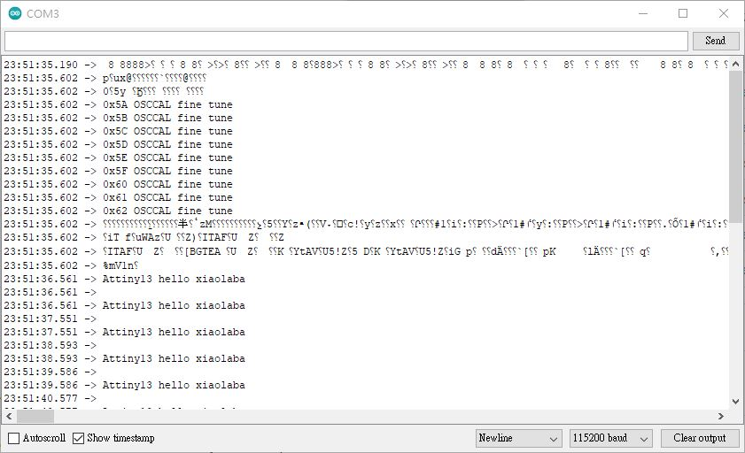

# AVR_Attiny13A_UART_OSCCAL  
clone and modified code, Attiny13A dump OSCCAL via software UART  
  

###software uart_tx routine by,  
http://nerdralph.blogspot.com/2014/01/avr-half-duplex-software-uart.html  

default baud rate, 115200, N81  

### modified code for testing only  
uart_pin.h, to change port pin for uart_Tx or uart_Rx  

### how to burn firmware  
drag and drop the hex to burn_Tiny13.bat  

i.e,  
Tiny13_UART_OSCCAL.ino_attiny13a_9600000L_PB0.hex, PB0 is used to dump string  
Tiny13_UART_OSCCAL.ino_attiny13a_9600000L_PB1.hex, PB1 is used to dump string  
